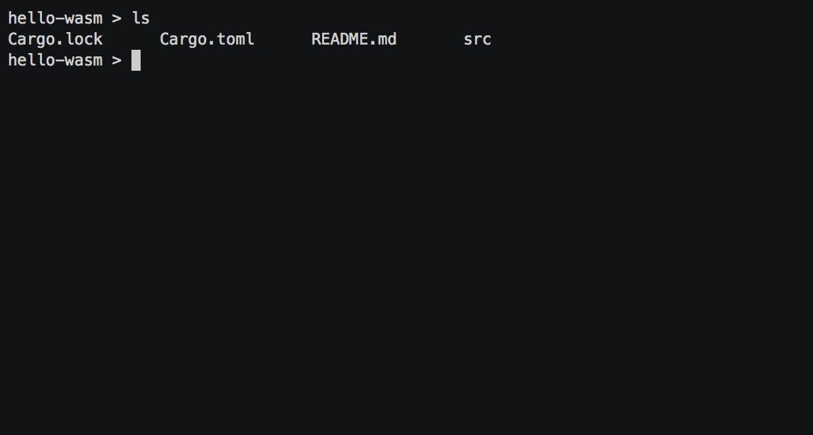

# NOTE: NOT A FORK

This repo is an archive of SPECULATIVE design work examining how certain
components of the `wasm-pack` codebase could be refactored to use a context
struct. This repo is not supported, should not be used, and is only here
for archiving purposes. Refer to the official wasm-pack repo if you would
like to learn more about wasm-pack.

# 📦✨  wasm-pack
> pack up the wasm and publish it to npm!

[](https://travis-ci.org/ashleygwilliams/wasm-pack)
[](https://ci.appveyor.com/project/ashleygwilliams/wasm-pack)

the goal of this project is to create a portable command line tool
for publishing compiled wasm projects to the npm registry for the consumption
of js devs using the npm CLI, yarn, or any other CLI tool that interfaces
with the npm registry.

this project is a part of the [rust-wasm] group. you can find more info by
visiting that repo!

[rust-wasm]: https://github.com/rust-lang-nursery/rust-wasm/



## 🔮 prerequisities

this project is written in rust. [get rust] to work on this project.

[get rust]: https://www.rustup.rs/

if you want to publish packages, you'll also need an account on [npm] and have
[node/npm] installed.

[npm]: https://www.npmjs.com
[node/npm]: https://nodejs.org/

## 🏃‍♀️ up and running

1. fork and clone this repository
2. install [node/npm]
2. `cd wasm-pack`
3. `cargo run`

## 💃 commands

- `help`: display available commands
- 🐣  `init`: create necessary files for js interop and npm publishing
  - optionally pass a path to a dir that contains a `Cargo.toml`, e.g.:
    ```
    wasm-pack init examples/js-hello-world
    ```
  - optionally pass a scope name to generate a `package.json` for a scoped pkg, e.g.:
    ```
    wasm-pack init examples/scopes-hello-world --scope test
    ```
    generates a `package.json` for an npm package called `@test/scopes-hello-world`
- 🍱  `pack`: create a tarball but don't push to the npm registry (see https://docs.npmjs.com/cli/pack)
- 🎆  `publish`: create a tarball and publish to the npm registry (see https://docs.npmjs.com/cli/publish)

## ⚙️  how to use

1. write a crate in Rust.
2. add `wasm-bindgen` to your `Cargo.toml`:

  ```toml
  [lib]
  crate-type = ["cdylib"]

  [dependencies]
  wasm-bindgen = "0.2"
  ```
3. add this to the top of your `src/lib.rs`:

  ```rust
  #![feature(proc_macro, wasm_import_module, wasm_custom_section)]

  extern crate wasm_bindgen;

  use wasm_bindgen::prelude::*;
  ```

4. annotate your public functions with `#[wasm_bindgen]`, for example:

  ```rust
  #[wasm_bindgen]
  extern {
      fn alert(s: &str);
  }

  #[wasm_bindgen]
  pub fn greet(name: &str) {
      alert(&format!("Hello, {}!", name));
  }
  ```

5. install this tool: `cargo install wasm-pack`
6. run `wasm-pack init`, optionally, pass a path to a dir or a scope (see above for details)
7. this tool generates files in a `pkg` dir
8. to publish to npm, run `wasm-pack publish` (making sure you are logged in with npm)

[rust-wasm/36]: https://github.com/rust-lang-nursery/rust-wasm/issues/36
[wasm-bindgen]: https://github.com/alexcrichton/wasm-bindgen
